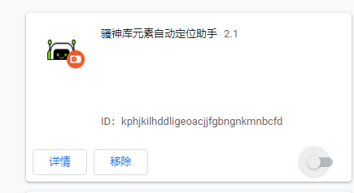
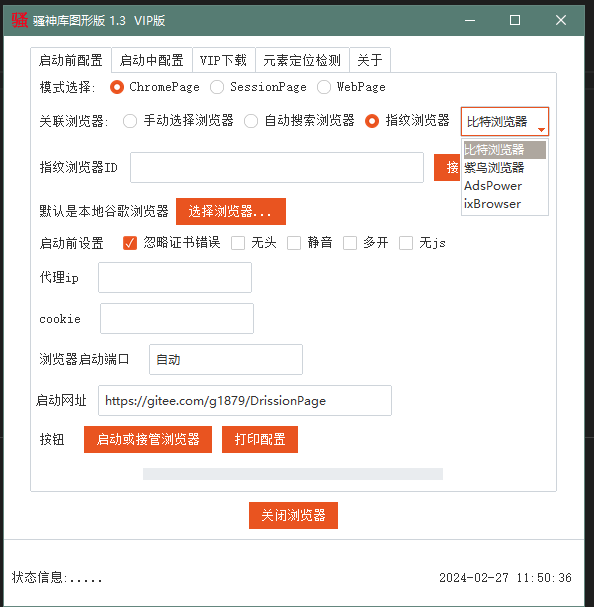
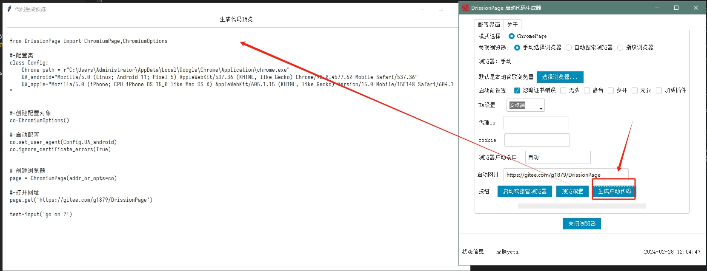
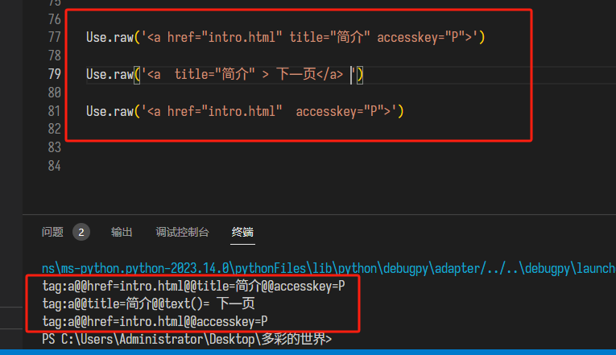

#  😈 SaossionPage 介绍 


 **SaossionPage**   简称 【骚神page】   Drissionpage 的姊妹版 Python库， 辅助 新手快速入门 Drissionpage库，能避免使用DP库中遇到的各种疑难杂症，还有更多实操教学案例..


骚神库网址 https://wxhzhwxhzh.github.io/saossion_code_helper_online/ 后续更新更精彩功能  顺手点个star⭐


---

###   _元素定位助手 和 代码生成助手_ -----> https://wxhzhwxhzh.github.io/saossion_code_helper_online/
---
#  ☠️ 黑魔法介绍


---
-  ### 👻 魔法-负一   浏览器插件  元素定位助手   实时获取页面元素的Drissionpage 定位语法
     
     
    
```
详情 --->  https://gitee.com/haiyang0726/SaossionPage/releases

```


---
-  ### 👻 魔法零  完全图形化操作 Drissionpage
     

```
  运行  这个示例代码文件     \0入门教学代码案例\Saossion_GUI.py
  提醒 ：pysimplegui  使用太高的库 可能会有注册登录提示   最好使用    pip install PySimpleGUI==4.60.5

```
---
-  ### 👻 魔法一   Drissionpage 代码助手  一键生成启动代码
     

```
  运行  这个示例代码文件     \Drissionpage代码助手\Drissionpage_code_helper.py
  

```
 


---
-  ### 👻 魔法二 raw()语法  将原生html标签语法转换成DP库元素语法


---
-  ### 🦇 魔法三  查看某个元素的子目录树

```
if __name__ == '__main__':
     
    #连接浏览器
    browser=Browser(r"C:\Program Files\Google\Chrome\Application\chrome.exe")

    browser.open('https://www.qq.com/')
    body=browser.newest_page('x:/html/body')
    Tool.tree(body)    

```
---
-  ### 🦴 魔法四  调用jQuery 操作网页元素


---
-  ### 👽 魔法七  傻瓜化浏览器启动配置

```
if __name__ == "__main__":


    # 魔法七 连接浏览器  傻瓜式自动识别配置
    browser = Browser(  r"C:\Users\Administrator\AppData\Local\Google\Chrome\Application\chrome.exe",config=' 静音  无图 代理http://127.0.0.1:1080 ')

    # 打开网站 
    browser.open('https://movie.douban.com/trailer/314095/#content')    


```

---
-  ### 👽 魔法八  页面元素可以按照指定百分比滑动

```
if __name__ == "__main__":


    #  连接浏览器  
    browser = Browser(  r"C:\Users\Administrator\AppData\Local\Google\Chrome\Application\chrome.exe",config='  ')

    # 打开网站 
    browser.open('https://auth.smartedu.cn/uias/login')
    browser.wait(2)
    
    tab=browser.newest_page    
   
    #获取滑块元素
    hua_kuai=tab.ele('.m_slider thumb')
    #滑块向右滑动  按照百分比滑动
    browser.ac(hua_kuai).go_right("80%")

    tab.run_js(r'alert("测试结束")') 

    browser.wait(55)   


```
-  ### 👽 魔法九  傻瓜式操作文件上传

```
if __name__ == "__main__":


    #  连接浏览器  
    browser = Browser(  r"C:\Users\Administrator\AppData\Local\Google\Chrome\Application\chrome.exe",config=' 忽略证书错误 ')

    # 打开网站 
    browser.open('https://www.imgtp.com/')
    browser.wait(2)

    #上传文件
    browser.upload(tag='选择 …',file_path=r'C:\Users\Administrator\Desktop\sao111.png')


```

---
-  ### 👽 魔法十  万能按钮

```
from sao import *
import os

if __name__ == '__main__':
    browser = Browser(Config.twinkstar_path,config=' 忽略证书错误   ')
    browser.open("https://greasyfork.org/zh-CN/scripts?filter_locale=0")
    time.sleep(2)
    


    #开启万能按钮模式，向网页注入js代码 并绑定相关按钮，实现了类似油猴插件的功能
    browser.god_button(name='翻译网页',onclick="makeTextTo('red')")
    browser.god_button(name='解析网盘',onclick="makeTextTo('blue')")

    browser.god_button(name='文字变色',onclick="makeTextTo('blue')")
    browser.god_button(name='背景切换',onclick="toggleBackgroundColor()")
    browser.god_button(name='自动翻页',onclick="scrollDownSlowly()")
    browser.god_button(name='Github增强',onclick="to_top()")


```

---
-  ### 👽 魔法十一  浏览器影分身功能  每个浏览器拥有独立用户cookie和浏览记录

```
if __name__ == '__main__':
    browser1 = Browser(Config.Chrome_path,config=' 忽略证书错误  多开   ')
    browser1.open("http://www.baidu.com")
    browser1.page.set.window.location(0,0)


    browser2 = Browser(Config.Chrome_path,config=' 忽略证书错误  多开   ')
    browser2.open("https://gitee.com/about_us")
    browser2.page.set.window.location(400,200)


    time.sleep(22)


```


